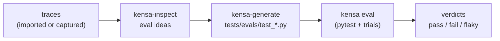

Kensa keeps the regression contract inside pytest. An eval is an ordinary test file: you define cases, run each one through your agent, assert on the resulting trace, and use a judge only for semantic checks.

## Directory layout

Evals live in your test tree. Kensa's generated evidence lives under `.kensa/`.

```bash
tests/evals/
├── conftest.py                 # your kensa_run harness fixture
├── test_kensa_smoke.py         # scaffolded smoke eval
└── test_<id>.py                # your evals (hand-written or materialized)

pyproject.toml
└── [tool.kensa]                # project config (kensa init)

.kensa/
├── connections/                # non-secret provider metadata (kensa connect)
├── inspect/                    # YAML eval-idea review queue (kensa inspect)
├── traces/
│   ├── imports/                # imported trace evidence (kensa import)
│   └── runs/                   # per-run trial traces (kensa eval)
└── results/                    # eval results (kensa eval)
```

You write evals and the `kensa_run` harness. `.kensa/` holds ignored runtime artifacts;
`kensa doctor` computes readiness live.

## Cases

A **case** is a single input to your agent, built with `kensa_case`:

```python
from kensa.pytest import kensa_case

kensa_case(id="refund_no_order", input="Refund my last charge. I do not have an order ID.")
```

Cases take either a literal `input` or a `messages` conversation. They are parametrized into a test with `@pytest.mark.parametrize("case", [...])`. See [Cases](/cases) for the full field reference.

## The harness

Kensa never guesses how to call your agent. You connect it once in `tests/evals/conftest.py` by implementing the `kensa_run` fixture, then run a case through it:

```python
result = case.run(kensa_run)
```

The fixture has already used the case to create one agent instance for the trial. `case.run(kensa_run)`
invokes its `respond(messages)` method and returns a `CaseResult` containing canonical
messages, evaluated output, one termination, and a read-only trace accessor. `kensa doctor` checks
that this harness reaches a real agent boundary rather than a stub.

## Traces

While a case runs, Kensa collects OpenTelemetry spans into a **trace** exposed on successful runs as
`result.trace`. Tool calls and model calls are captured automatically when you wrap them with the
recording helpers (`record_tool_call`, `record_llm_call`) or run instrumented SDK code. Imported
evidence is narrower than raw telemetry: Kensa keeps only its allowlisted TraceView fields and
redacts retained values before storage.

`result.trace` exposes:

| Accessor | What it returns |
|---|---|
| `result.trace.tools` | Tool-call assertions (`include`, `exclude`, `order`, `no_repeats`, `names`) |
| `result.trace.cost_usd` | Total trace cost in USD |
| `result.trace.llm_turns` | Count of LLM spans |
| `result.trace.duration_ms` | Total trace duration |
| `result.trace.spans` | Raw collected spans |

The `kensa_trace` fixture remains available as an independent trial accessor for failures, timeouts,
and existing evals. On success inside a managed trial, `result.trace is kensa_trace`.

## Assertions

Assertions answer binary questions about the run. **Deterministic** assertions are free and fast - plain `assert` and `result.trace.*` (tool calls, cost, turns, latency). Because pytest stops at the first failed assertion, ordering them before the judge means obvious regressions never reach an LLM call.

A **judge** is the semantic escape hatch: `judge(result, criteria, ...)` sends ordered
messages, normalized output, and termination as structured evidence. Use it only for criteria that
resist deterministic checks. Trace evidence remains explicit: pass `trace=result.trace` when the
criterion needs it. See [Assertions](/assertions) and [Judge](/judge).

## Trials

Agents are non-deterministic, so an eval can run a case more than once:

```python
@pytest.mark.kensa(trials=3)
```

Each trial is one pytest item with its own trace. Kensa aggregates the trials per case into a single verdict at session end.

| Verdict | Meaning |
|---|---|
| `pass` | Every trial passed |
| `fail` | Every trial failed |
| `flaky` | At least one trial passed and at least one failed |
| `error` | A test, fixture, trace, or setup error occurred |
| `partial` | Fewer trials completed than configured |

`fail`, `flaky`, and `error` fail the pytest session. `trials: 1` is a smoke check; `trials > 1` is measured evidence.

## Eval ideas

When you have trace evidence, your coding agent (the `kensa-inspect` skill) mines it into reviewable **eval ideas** - proposed evals recorded as a YAML review queue under `.kensa/inspect/`. You approve the ones worth keeping by changing `status: pending` to `status: approved`, validate the queue with `kensa inspect lint`, then the `kensa-generate` skill materializes them as `tests/evals/test_<id>.py`. Materialized evals are plain pytest files you own and edit.

## Pipeline



Every stage is optional on its own: you can hand-write evals and skip generation, or run plain `pytest tests/evals/` and skip the `kensa` CLI entirely.
