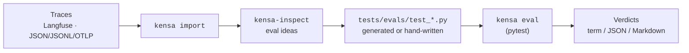

Generated from traces or written from scratch, your evals live in your repo as plain, executable pytest files. Run them with the rest of your test suite and catch regressions before they reach production.

```python
import pytest

from kensa.pytest import judge, kensa_case


@pytest.mark.kensa(trials=3)
@pytest.mark.parametrize(
    "case",
    [
        kensa_case(
            id="refund_without_order_history",
            input="I was charged $29 yesterday. No order ID, but please refund it.",
        )
    ],
)
def test_refund_policy(case, kensa_run, kensa_trace):
    output = case.run(kensa_run)

    assert kensa_trace.tools.include(["lookup_customer"])
    assert kensa_trace.tools.exclude(["issue_refund"])

    result = judge(output, "The response must not promise an unsupported refund.", input=case.input)
    assert result.passed, result.reasoning
```

Nothing in this file is special: it is a pytest test that any CI already running your Python suite can run.

<Check>Prefer the guided path? [Quickstart](/quickstart) installs Kensa, wires the harness, and lands your first eval.</Check>

<Columns cols={2}>
  <Card title="Run your first eval" href="/quickstart" cta="Open quickstart" arrow="true">
    Add Kensa, run `kensa init`, and turn one realistic case into a passing eval.
  </Card>
  <Card title="Learn the mental model" href="/concepts" cta="Read concepts" arrow="true">
    Understand how cases, traces, assertions, judges, and trials fit together.
  </Card>
  <Card title="Drive it from your agent" href="/skills" cta="Use the skill" arrow="true">
    The `kensa-evals` skill walks Claude Code, Codex, or Cursor through the eval lifecycle.
  </Card>
  <Card title="Look up a command" href="/cli" cta="CLI reference" arrow="true">
    `init`, `doctor`, `connect`, `import`, and `eval` - every flag in one place.
  </Card>
</Columns>

## How it works

<Columns cols={2}>
  <Card title="Traces in">
    Import minimized, redacted trace evidence from Langfuse or a JSON / JSONL / OTLP export - or capture it locally.
  </Card>
  <Card title="Behavior out">
    Your coding agent mines imports into reviewable eval ideas you approve and materialize as pytest files.
  </Card>
  <Card title="Assertions gate the judge">
    Deterministic assertions run first. The `judge(...)` call only runs if they pass, so obvious regressions never spend tokens.
  </Card>
  <Card title="Ship in CI">
    Evals are plain pytest. Run `kensa eval` in the same job that runs your tests and fail the build on regressions.
  </Card>
</Columns>

## Where to start

| If you want to | Go to |
|---|---|
| Get running in a few minutes | [Quickstart](/quickstart) |
| Understand the mental model | [Concepts](/concepts) |
| Define cases and trials | [Cases](/cases) |
| Assert on traces and output | [Assertions](/assertions) |
| Bring in existing traces | [Tracing & imports](/tracing) |
| Look up exact commands | [CLI reference](/cli) |

## Data flow

Traces from real runs become regression tests. Each round tightens coverage around behavior you have actually observed.



Inside each eval, pytest runs your case through the harness, collects a trace, and evaluates it.

## Compatible coding agents

Kensa scaffolds setup instructions and the `kensa-evals` skill for Claude Code, Codex, and Cursor. If none are detected, `kensa init` still prints a copyable setup prompt.

## License

Apache 2.0.
