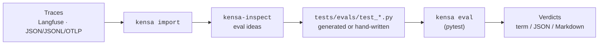

Kensa turns agent traces into Python or TypeScript evals that run in CI. Generated from traces or written from scratch, they live in your repo and run with the rest of your test suite.

```python
import pytest

from kensa.pytest import judge, kensa_case


@pytest.mark.kensa(trials=3)
@pytest.mark.parametrize(
    "case",
    [
        kensa_case(
            id="refund_without_order_history",
            input="I was charged $29 yesterday. No order ID, but please refund it.",
        )
    ],
)
def test_refund_policy(case, kensa_run):
    result = case.run(kensa_run)

    assert result.trace.tools.include(["lookup_customer"])
    assert result.trace.tools.exclude(["issue_refund"])

    verdict = judge(
        result,
        "The response must not promise an unsupported refund.",
        input=case.input,
        trace=result.trace,
    )
    assert verdict.passed, verdict.reasoning
```

Python projects install `kensa` and import the pytest authoring API from `kensa.pytest`. TypeScript projects install `@kensa/sdk` and import its Vitest adapter from `@kensa/sdk/vitest`.

<Check>Prefer the guided path? [Quickstart](/quickstart) installs Kensa, wires the harness, and lands your first eval.</Check>

<Columns cols={2}>
  <Card title="Run your first eval" href="/quickstart" cta="Open quickstart" arrow="true">
    Add Kensa, run `kensa init`, and turn one realistic case into a passing eval.
  </Card>
  <Card title="Learn the mental model" href="/concepts" cta="Read concepts" arrow="true">
    Understand how cases, traces, assertions, judges, and trials fit together.
  </Card>
  <Card title="Use TypeScript and Vitest" href="/typescript" cta="Open TypeScript guide" arrow="true">
    Define an evaluation with `@kensa/sdk` and run it in your existing Vitest suite.
  </Card>
  <Card title="Drive it from your agent" href="/skills" cta="Use the skill" arrow="true">
    The `kensa-evals` skill walks Claude Code, Codex, or Cursor through the eval lifecycle.
  </Card>
  <Card title="Look up a command" href="/cli" cta="CLI reference" arrow="true">
    `init`, `doctor`, `connect`, `import`, and `eval` - every flag in one place.
  </Card>
</Columns>

## Python trace-to-eval workflow

<Columns cols={2}>
  <Card title="Traces in">
    Import minimized, redacted trace evidence from Langfuse or a JSON / JSONL / OTLP export - or capture it locally.
  </Card>
  <Card title="Behavior out">
    For Python projects, your coding agent mines imports into reviewable eval ideas you approve and materialize as pytest files.
  </Card>
  <Card title="Assertions gate the judge">
    Deterministic assertions run first. The `judge(...)` call only runs if they pass, so obvious regressions never spend tokens.
  </Card>
  <Card title="Ship in CI">
    Run Python evals with pytest or TypeScript evals with Vitest and fail the build on regressions.
  </Card>
</Columns>

## Where to start

| If you want to | Go to |
|---|---|
| Get running in a few minutes | [Quickstart](/quickstart) |
| Author TypeScript evals | [TypeScript SDK](/typescript) |
| Understand the mental model | [Concepts](/concepts) |
| Define cases and trials | [Cases](/cases) |
| Assert on traces and output | [Assertions](/assertions) |
| Bring in existing traces | [Tracing & imports](/tracing) |
| Look up exact commands | [CLI reference](/cli) |

## Python data flow

Traces from real runs become regression tests. Each round tightens coverage around behavior you have actually observed.


```mermaid
flowchart LR
  A["Traces<br/>Langfuse · JSON/JSONL/OTLP"] --> B["<code>kensa import</code>"]
  B --> C["<code>kensa-inspect</code><br/>eval ideas"]
  C --> D["<code>tests/evals/test_*.py</code><br/>generated or hand-written"]
  D --> E["<code>kensa eval</code><br/>(pytest)"]
  E --> F["Verdicts<br/>term / JSON / Markdown"]
```

Inside each Python eval, pytest runs your case through the harness, collects a trace, and evaluates it.

## Compatible coding agents

Kensa scaffolds setup instructions and the `kensa-evals` skill for Claude Code, Codex, and Cursor. If none are detected, `kensa init` still prints a copyable setup prompt.

## License

Apache 2.0.
