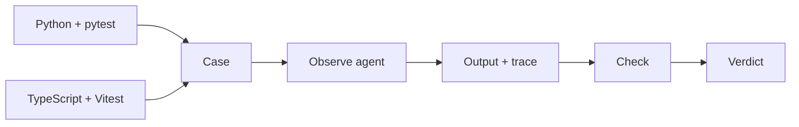

Kensa turns agent traces into Python or TypeScript evals that run in CI. Generated from traces or written from scratch, they live in your repo and run with the rest of your test suite.

## Choose your SDK

| | Python | TypeScript |
|---|---|---|
| Install | `kensa` | `@kensa/sdk` and `vitest` |
| Test runner | pytest | Vitest |
| Authoring API | `kensa.pytest` | `@kensa/sdk/vitest` |
| Run | `kensa eval` or `pytest` | `vitest run` |
| Additional surface | Trace capture, imports, mining, judges, and the Kensa CLI | Runner-neutral evaluation through `@kensa/sdk` |

### Python with pytest

```python
import pytest

from kensa.pytest import kensa_case


@pytest.mark.kensa(trials=3)
@pytest.mark.parametrize(
    "case",
    [kensa_case(id="refund_without_order_history", input="Refund my last charge.")],
)
def test_refund_policy(case, kensa_run):
    result = case.run(kensa_run)
    assert result.trace.tools.exclude(["issue_refund"])
```

### TypeScript with Vitest

```typescript
import { kensaTest } from "@kensa/sdk/vitest";

kensaTest("does not issue an unsupported refund", {
  case: {
    id: "refund_without_order_history",
    input: "Refund my last charge.",
    metadata: {},
  },
  observe: observeRefund,
  check: checkRefundPolicy,
});
```

`observeRefund` calls your agent and returns its output and trace evidence. `checkRefundPolicy` evaluates that observation. See the [TypeScript SDK](/typescript) guide for the complete callback shapes.

## Shared evaluation model

Both SDKs follow the same sequence while keeping your agent code in its native runtime.


```mermaid
flowchart LR
  P["Python + pytest"] --> C["Case"]
  T["TypeScript + Vitest"] --> C
  C --> O["Observe agent"]
  O --> E["Output + trace"]
  E --> K["Check"]
  K --> V["Verdict"]
```

Python owns pytest fixtures, callbacks, instrumentation, and the trace-to-eval CLI workflow. Its bundled engine owns evaluation state, normalization, aggregation, reporting, and result construction. TypeScript imports the shared semantic core in process and uses Vitest only as the test adapter.

## Where to start

| If you want to | Go to |
|---|---|
| Start with Python and pytest | [Python quickstart](/quickstart) |
| Start with TypeScript and Vitest | [TypeScript SDK](/typescript) |
| Understand the mental model | [Concepts](/concepts) |
| Bring in existing traces | [Tracing & imports](/tracing) |
| Run either SDK in CI | [CI](/ci) |
| Use the Python CLI | [CLI reference](/cli) |

## License

Apache 2.0.
